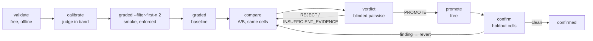

# prompt-eval-engine

<!-- Template users: point the badge (and the repository field in
     package.json/pyproject.toml) at your own fork — this one reports the
     upstream repo's build. -->
[](https://github.com/AlqarniMohammed/prompt-eval-engine/actions/workflows/ci.yml)
[](LICENSE)

**Prove a prompt change is better before you ship it — and put a hard dollar
ceiling on finding out.** A prompt-eval pipeline with hard spending limits, a
calibrated judge, and a promotion protocol that won't let you fool yourself.

**promptfoo is the engine; Python is the steering wheel.** Every eval run is a
`promptfoo eval` invocation; the Python layer adds only what promptfoo (and, per an
August-2026 market survey, every other framework) verifiably lacks. The short
version is in [Why this repo](#why-this-repo-and-when-not); the verified
capability-by-capability table lives in [docs/comparison.md](docs/comparison.md).

## What is a prompt eval? (start here if this is new)

When you build on an LLM, your *prompt* is code — but you can't unit-test it with
`assert output == expected`, because the model's output is open-ended prose. A **prompt
eval** is the testing discipline that fills that gap:

1. **A dataset of test cases** — realistic user inputs, fed to your prompt.
2. **Deterministic checks ("contracts")** — cheap, free assertions on the output:
   required sections present, no forbidden content, valid format.
3. **An LLM judge** — a *different* model that grades each output against a written
   rubric (1–5 per dimension), for the qualities regex can't check.
4. **A comparison protocol** — when you edit your prompt, the old and new versions run
   on the same cases and a *blinded* judge picks the winner, so you promote changes on
   evidence instead of vibes.

Two things make or break the grading. The judge must not be the model being tested
(models rate their own output generously), and the judge itself must be **calibrated**:
before it grades anything real, it must correctly score known-good and known-bad sample
outputs ("golden fixtures"). A judge that can't pass that test would produce scores that
look precise and mean nothing.

Evals cost real money — every test case is API calls. The first campaign behind this
engine overspent by ~3× through concurrent runs, silent retries, and truncated-output
re-billing; the whole engine is shaped by that post-mortem
([LESSONS-LEARNED.md](LESSONS-LEARNED.md)). Cost governance here is not a feature, it's
the point.

## Quick start

**Requirements:** Node ≥ 22.22 (`.nvmrc` says 24; `npm ci` refuses older —
`engine-strict` is on), Python ≥ 3.10, [uv](https://docs.astral.sh/uv/), and a
POSIX platform (Linux, macOS, or WSL2 — native Windows is not supported: live
runs use process groups and POSIX locks).

```bash
npm ci                 # promptfoo, exact-pinned in package.json
uv sync                # python deps + the CLI (uv: https://docs.astral.sh/uv/)
cp .env.example .env   # add ANTHROPIC_API_KEY (plus OPENAI_API_KEY for an openai:* judge) — API-key transport ONLY
uv run prompt-eval doctor     # environment sanity (free)
uv run prompt-eval round      # where every suite stands + the exact next command
```

`round` is the front door: run it whenever you're unsure what to do next — it prints
each suite's pipeline position and the next required command. The repo ships **bare**
(no prompts registered — the project layer is yours), so on a fresh clone `round`
points you at [Reusing this engine](#reusing-this-engine-for-your-own-project)
to add your first suite. Everything before your first paid call is free: `validate`
proves the whole path (datasets, contracts, judge plumbing) offline with mock models.

Want a guided tour on real content first? A complete worked example ships in
`examples/support-reply/` — adopt it with `uv run prompt-eval init --example
support-reply` and follow its `WALKTHROUGH.md` (the free half is verbatim console
output, verified in CI on every commit; the paid half is honestly shape-only).


## The pipeline, end to end

A **suite** is one prompt under test plus its dataset, contracts, and rubric. Each suite
advances through six recorded stages; the state machine (`src/state.py`, working state
in `outputs/.state.json`) refuses any step whose predecessor is missing or stale, and
`--force` bypasses are recorded, never silent:



| Stage | Command | What it proves |
|---|---|---|
| validated | `validate` | declarations, matrices, and golden contracts are coherent (free) |
| calibrated | `calibrate` | the judge lands all samples in band on golden fixtures |
| baselined | `graded` | production prompt scored on the full matrix (a `--filter-first-n` smoke run is required first — see below) |
| compared | `compare` | candidate prompt A/B'd against production on the same cells |
| promoted | `verdict` + `promote` | blinded pairwise verdict says PROMOTE; candidate becomes production |
| confirmed | `confirm` | promotion holds on held-out cells the optimization never saw |

A clean full `confirm` records the `confirmed` stage; any holdout finding means the
promotion is reverted (copy the prior production prompt back) and the pipeline
returns to `compare` — a failed confirmation is never argued with.

Supporting commands: `preflight` (one real call with the configured model + caps —
required before campaigns), `baseline` (binary-tier run on the deterministic contracts
only), `matrix` (regenerate graded cells from specs), `gen-cases` (draft new test cases
— see below).

Earning an earlier stage invalidates everything after it: re-validating after prompt
surgery forces a re-baseline. When a *config-only* edit wipes stages whose own inputs
never changed, `graft` restores them from the automatic snapshot — it re-records only
entries whose content fingerprints still match, so it can't be used to smuggle stale
results past the gates.

### Reading a run's artifacts

Every run writes a directory under `outputs/runs/` (gitignored scratch), and the
durable audit trail accumulates in `outputs/history/` (tracked). What each file is
*for*:

- **`manifest.json`** — the run's reproducibility contract: content SHAs of every
  prompt/wrapper/rubric/config involved, effective models and caps, every env override
  actually used, forced-gate bypasses, and measured spend. Written *before* the first
  call (so even a crashed run is accounted for) and rewritten after. When you ask "what
  exactly ran?", this file is the answer.
- **`report.md`** — the human scorecard: honest status line (a failed run says FAILED),
  findings with their failing-assert reasons, dimension means, spend, truncated cells,
  and alerts. Read this before the pass/fail line convinces you everything is fine.
- **`run.json`** — the consolidated machine-readable record (versioned
  `schemaVersion`): manifest, spend, cache savings, alerts, truncated cells, and
  one row per case with scores and failing reasons. The single integration point
  for scripts and dashboards; `report --format json` regenerates and prints it.
- **`status.jsonl` / `spend.jsonl` / `judge-evidence.jsonl`** — append-only event,
  ledger, and judge-rationale streams; the watchdog and the dashboard read them live.
- **`outputs/history/*.json`** — one durable record per graded run, calibration, and
  compare verdict. Cost estimates learn from these (measured beats guessed), the
  dashboard's trend lines are drawn from them, and they are the source of last resort
  when working state is lost.

The dashboard renders all of this; `prompt-eval report <run_dir>` regenerates the
scorecard.

### Subset-first, enforced

The cheapest lesson of the post-mortem: **never point a full dataset at a new
configuration.** A full `graded` run refuses to start until a small smoke run
(`graded --suite <id> --filter-first-n 2`) has succeeded for the same suite content and
models. Runtime errors, timeouts, and misconfiguration surface on 2 cells, not 40.

## The three models (and why they're different sizes)

The engine distinguishes three model roles, configured in `config/eval_config.yaml`:

- **Generation** (`agents.generation`, default `claude-sonnet-5`) — the model under
  test. **Match this to what you actually ship**; `project.production_model` declares
  that, and `doctor` warns when they differ. Evaluating a model you don't deploy
  measures the wrong system.
- **Judge** (`agents.judge`, default `claude-sonnet-4-6`) — grades outputs. Must differ
  from generation (hard error, not a warning), should be tier-comparable, and is valid
  only behind a green calibration. It runs at temperature 0 by default (graders should
  be deterministic; sampling noise otherwise lands directly in the scores), and the
  temperature is part of the calibration fingerprint — changing it forces a
  recalibration. Cross-family judging (e.g. an OpenAI judge for a
  Claude system) is supported: set `openai:<model>` as the judge model and install the
  extra (`uv sync --extra cross-judge`); calibration is required before first use, like
  any judge change.
- **Dataset generator** (`agents.dataset`, default `claude-haiku-4-5`) — simulates
  users for `gen-cases`. Cheap is *correct* here: it writes the inputs going INTO the
  system, not the outputs being judged. A strong model "helpfully" writes polished,
  best-practice prompts no real user would type — and an eval fed idealized inputs
  measures the wrong thing. The generator is explicitly instructed to write terse,
  underspecified, ordinary-user messages, and its output lands as a **draft** for human
  review (`datasets/generated/`), never wired into a suite automatically.

### Picking the production model: the stabilization sweep

To choose which model (or tier) to ship, run cheap smoke baselines per candidate and
watch where scores stabilize: if one tier scores 6/10, the next 8/10, and the tier above
8.9–9.0, the curve has flattened — buy the cheapest model past the knee. Recipe in
[RUNBOOK.md](RUNBOOK.md).

### Improving a prompt: hypothesis first

The compare/verdict loop measures changes; it doesn't invent them. Make changes the way
the eval's own findings suggest: observe a concrete failure in the reports ("outputs
skip calories", "meals listed wrong under pressure"), form a hypothesis grounded in a
known technique ("an output contract will pin the format", "a worked example will hold
under pressure"), change *that one thing*, and let `compare` + `verdict` say whether it
worked. "Hey AI, my prompt isn't working well, fix it" is not a hypothesis — changes you
can't explain can't teach you anything when they win, and mislead you when they lose.

## Why this repo (and when not)

Verified against promptfoo 0.122.0 source and an August-2026 survey of Inspect AI,
DeepEval, Braintrust, Langfuse, LangSmith, OpenAI Evals, Weave, Phoenix, and Harbor.
The full capability table — survey date, versions, per-claim sources, and a
staleness banner — lives in **[docs/comparison.md](docs/comparison.md)**. What no
surveyed tool shipped: run-level cost governance with a measured pre-run gate and
mid-run kill switch, judge calibration that *gates* every graded run, blinded
position-swapped pairwise promotion with idempotent verdicts, and a content-hash
pipeline state machine.

**Use something else when:** you want a hosted team UI (Braintrust/Langfuse), you're
evaluating models rather than your own prompts (Inspect AI), you need only ad-hoc
assertions on a few prompts (plain promptfoo is simpler), or you have no spend risk
worth governing.

**Use this when:** paid eval runs need hard ceilings and an audit trail, your judge's
scores must be *provably* meaningful, and prompt promotions should survive an honest
protocol. If those are your constraints, no surveyed tool ships them — that verified gap
is why this layer exists.

## Status: complete

v1.0.0 ([CHANGELOG.md](CHANGELOG.md)) is the finished form of this project:
**bug-fixes-only** from here. The scope was set by an external review and closed
deliberately — no feature roadmap, no community growth machinery, no plugin API.

**Deliberately not on PyPI.** This engine is a repo you clone or use as a
template, not a package you install: the top-level package is named `src` and
that name is fingerprinted into every recorded history path (renaming it would
stale the entire audit trail), and the CLI is anchored to a checkout
(repo-local promptfoo configs and `node_modules`). An installed copy would
shadow user packages and not function outside a checkout — publishing it would
be packaging theater.

### Non-goals

- **No hosted service or team UI.** The dashboard is local, read-only, and
  bound to 127.0.0.1 on purpose — run artifacts contain your prompt text.
  Braintrust and Langfuse do hosted well; this project won't badly.
- **No model-generated golden fixtures** (a `gen-fixtures` command is
  rejected, permanently). A golden drafted by the judge's own model family is
  the engine calibrating against itself — the scores would agree with the
  judge because they came from it. Goldens are human-curated or they are not
  goldens ([docs/calibration.md](docs/calibration.md)).
- **No plugin API, no pytest plugin.** `run.json` and the thin Python facade
  (`src/api.py`) are the integration surface; a plugin API is a compatibility
  treadmill a bug-fixes-only project must not board.
- **No scheduler.** `monitor` runs when you invoke it; recurring invocation
  belongs to cron/CI, which already exist.

## CLI reference

```bash
uv run prompt-eval <command> [options]
```

| Command | Cost | Purpose |
|---|---|---|
| `round` | free | pipeline status + the next required action — **run this first** (`--run`, with `--suite`, executes exactly that one printed command after confirmation) |
| `init` | free | adopt a prompt/bundle dropped into `input/` — detects the type, scaffolds a valid suite, wires the config (`--as`, `--suite`, `--yes`, `--dry-run`, `--print-config`; `--example` adopts a shipped example bundle; `--rubric` picks a reviewed task-kind rubric template, explicit on purpose — a silently wrong guess would poison calibration) |
| `doctor` | free | environment sanity (+ warns if you're testing a model you don't ship; verifies the cross-family judge's key/SDK when one is configured) |
| `validate` | free | offline gate: declaration checks + golden sweeps with mock models |
| `preflight` | ~$0.05 | real-config smoke: configured model + caps, streaming judge |
| `calibrate` | live | judge calibration vs golden fixtures |
| `gen-cases` | live | draft ordinary-user test cases with the cheap dataset model (`--count`, `--out`) |
| `matrix` | free | regenerate graded matrices from specs |
| `baseline` | live | binary-tier run (deterministic contracts only) |
| `graded` | live | graded-tier matrix run, k trials, judge-scored (smoke-gated) |
| `compare` | live | graded A/B of production vs candidate |
| `verdict` | live | blinded pairwise verdict on a required `--target` dimension (defaults to the newest compare/confirm results) |
| `promote` | free | apply a PROMOTE verdict (candidate → production) |
| `confirm` | live | post-promotion holdout confirmation |
| `graft` | free | restore wiped pipeline state whose fingerprints still match (`--snapshot` to save, `--from-history` to rebuild from history records) |
| `report` | free | regenerate reports for a run dir (`--format` md or json) |
| `dashboard` | free | local read-only dashboard: live run, pipeline, spend, trends, judge evidence (`--port`, `--open`) |
| `cache` | free | `ls` / `stat` / `verify` / `gc` (`--older-than`, `--suspects`) |
| `history` | free | `verify` — walk the hash-chained audit ledgers and report any tampering |
| `pin` | free | pin a failing cell (`--run`, `--cell`, `--note`) into `datasets/regression/` — it then runs in every graded-tier pass and any failure fails the run loudly |
| `spot-check` | free | interactive human audit of judge verdicts on a finished run (`--run`, `--n`): blind labels first, judge revealed after; rolling agreement gates trust |
| `why` | free | explain each suite's blocked stage in prose: what's stale on which fingerprint key, and the exact command that fixes it |
| `monitor` | live | model-drift canary: tiny fixed graded subset (default 2 cells) vs the baselined dimension means; exit 1 on drift; no scheduler |
| `perturb` | live | draft paraphrase variants of existing probes with the cheap dataset model (`--variants`); drafts only, never auto-wired |

Live-run options (on `baseline`, `graded`, `compare`, `confirm`): `--suite`, `--repeat`,
`--jobs`, `--max-cost` (raise the ceiling; recorded), `--force` (bypass gates; recorded),
`--resume` (promptfoo native), `--filter-first-n`, `--require-clean` (refuse a dirty
tree — use for campaigns), and `--dry-run` (print the full cost breakdown — per-role
calls, unit costs, estimate basis, total vs ceiling — and exit before any call; also
on `calibrate`, `verdict`, `gen-cases`, `monitor`, `perturb`, and `init`). `verdict` takes `--target`, `--reason` /
`--new-evidence` for repeat verdicts, and — like every spending command — estimates
its judge calls against the ceiling before the first call (`--max-cost` / `--force`
to override, both recorded).

## Local dashboard

```bash
uv run prompt-eval dashboard --open      # http://127.0.0.1:8642 — free, read-only
```


*(Captured mid-flight during a real `graded` run — generation pointed at a
local http endpoint and the judge mocked, so the whole run cost $0; the
progress, event stream, spend meter, and honest unmetered-generation alert
are all live engine output. Full-page views in light and dark:
[light](docs/assets/dashboard-full-light.png) ·
[dark](docs/assets/dashboard-full-dark.png).)*

One self-contained page over the run artifacts, owning exactly what the engine owns:
a **live panel** (active-run detection, progress and ETA, measured spend against the
effective ceiling, exact-cap alerts, a stall flag at 2× `observability.heartbeat_seconds`),
the **pipeline state machine** per suite with staleness and an explainer of what every
stage proves, **history trends** (dimension means per suite across graded runs,
calibration timeline, spend by mode), **verdicts** with their pairwise tallies, and
**judge evidence** (score histograms, worst-scored cells in the judge's own words,
deduped suggested prompt fixes, judge errors). It binds to localhost only (artifacts
contain prompt text), never writes, and re-reads artifacts fresh on every poll — safe
to leave open next to a running eval. Per-case output browsing stays with
`promptfoo view`, which already does that well.

## Configuration

`config/eval_config.yaml` is the single declaration file bridging the generic engine in
`src/` and the project layer. It declares suites, the three model roles, pricing,
governance thresholds, project paths, and the graded-tier science (adaptive-k
screening, calibration bands, promotion heuristics, re-eval triggers).

Guardrail defaults that matter:

- `governance.max_run_cost_usd: 1.00` — every live command aborts above the ceiling
  unless `--max-cost` raises it explicitly (and that's recorded). Optional finer
  ceilings: per-role (`governance.max_cost_usd` for generation/judge/dataset), a
  per-suite `max_run_cost_usd` on the suite entry, and rolling `max_daily_usd` /
  `max_weekly_usd` windows read from the durable cross-run ledger
  `outputs/history/spend-ledger.jsonl` (`round` and `doctor` show the 24h/7d totals).
- Cost estimates come from **measured run history**, cache-aware; config guesses are
  the fallback only when no history exists.
- The failure breaker aborts on 4 consecutive errors or >50% error rate — a
  100%-failing run never burns to the dollar cap.
- Unknown models price at the **most expensive** row, so a mispricing over-counts.
  `pricing.last_verified` stamps when the table was last checked; `doctor` warns
  when it is missing or older than 180 days (stale prices skew every estimate).
- A compare below `graded.promotion.min_cells` (default 3) returns
  `INSUFFICIENT_EVIDENCE` (exit code 2) **before spending a single pairwise judge
  call** — distinct from REJECT: the remedy is a bigger matrix, not new evidence.
  Optional `graded.promotion.max_sign_p` turns a would-be PROMOTE on a thin
  sign-test p into `INSUFFICIENT_EVIDENCE` too (off by default — the shipped
  6-cell matrix can't clear p < 0.05 without a unanimous sweep).
- The verdict promotes only on `graded.promotion.min_pairwise_wins` (default 2)
  both-order blinded cell wins with zero current-side wins.

**The detectable-effect floor is a stated tradeoff.** The default matrix is small on
purpose (8 cells, 2 of them holdout — a cost decision, not a statistics one). At that
size the verdict's paired sign test cannot reach p < 0.05 short of a unanimous 6–0
sweep (p = 0.031), and the 95% confidence interval on the target-dimension delta is
wide. The verdict table prints both numbers — reported, never gated on — so small-n is
visible instead of implied. If you need to detect small effects, scale the matrix
(`graded.max_cells_per_suite`), don't reinterpret the numbers.

### HTTP-provider suites (evaluate a deployed endpoint)

A suite can point generation at a deployed HTTP endpoint instead of the agent-sdk
provider — the judge, calibration, verdicts, and governance stay identical:

```yaml
suites:
  - id: my-api-suite
    file: datasets/my-api-suite.yaml
    rubric: judges/my-api-suite.md
    provider:
      type: http                             # the only supported per-suite type
      url: https://api.example.com/generate
      # every other key passes to promptfoo's HTTP provider verbatim:
      # method, headers, body, transformResponse, ...
```

What changes on an http run:

- **Single-suite only.** The endpoint is a config-level promptfoo provider (test-level
  provider dicts from Python generators are silently ignored), so an http run cannot
  mix with agent-sdk suites — pass `--suite`.
- The runner materializes a per-run promptfoo config (`promptfooconfig.http.yaml`
  inside the run directory); the checked-in configs stay agent-sdk-only.
- No fixture workspaces, no agent-sdk options, no bundle transform: the endpoint
  receives the rendered prompt text and returns text.
- **Generation cost is unmetered** — the endpoint bills its owner, invisibly to this
  ledger. Generation rows are recorded as `cost_unknown` at $0 and the run prints a
  loud alert: the cost ceiling governs **judge spend only**. Header *values* never
  land in the run manifest — only their key names.

### Multi-turn cases (honest scope: simulation)

A case may declare the conversation that led up to the request being graded:

```yaml
- description: follow-up after a refund was promised
  messages:
    - { role: user, content: "my order arrived broken" }
    - { role: assistant, content: "So sorry — I've issued a refund." }
    - { role: user, content: "it's been a week and no refund has landed" }
  vars: { promptFile: demo.md, golden: demo }
```

Validated offline (free, in `validate`): roles must alternate, the last turn must be
`user`, and `messages:` is mutually exclusive with `vars.probe` — the final user turn
IS the probe. The prior turns are rendered into the prompt as a clearly labeled
simulated-transcript block, and the run manifest flags `simulatedMultiTurn` so no
downstream reader mistakes it for the real thing.

**The limitation, stated plainly:** true message-array turns are unreachable through
the agent-sdk provider (single free-text prompt in, internal loop); real multi-turn
requires an http suite (above) whose endpoint accepts a message array.

Env vars are *overrides, not the interface* — every override actually used is recorded
in the run manifest. Public overrides: `EVAL_CONFIG`, `EVAL_MODEL`, `EVAL_JUDGE_MODEL`,
`EVAL_REPEAT`, `EVAL_MAX_BUDGET_USD`, `EVAL_CAL_SAMPLES`, `EVAL_ADAPTIVE_K`,
`EVAL_MONITOR_CELLS`. The rest (`EVAL_SUITE`, `EVAL_HOLDOUT`, `EVAL_OFFLINE`,
`EVAL_RUN_DIR`, `EVAL_SPOT_ANSWERS`, `GOLDEN_SET`, `GOLDEN_VARIANT`, `MOCK_*`) are
internal plumbing between the runner, its promptfoo children, and the test suite.

## Reusing this engine for your own project

The repo ships **bare**: everything in `src/` is the generic engine, and the project
layer is entirely yours. The fast path is the **`input/` drop box**:

```bash
cp ~/my-prompt.md input/          # drop a prompt (or a whole folder)
uv run prompt-eval init           # detect → scaffold → register → teach
uv run prompt-eval validate       # green immediately
```

`init` detects what you dropped — a bare prompt, a prompt + wrapper pair, an
agent prompt (tool use, workspace files), or a full bundle (dataset + rubric +
goldens, registered as-is) — moves it into place, scaffolds everything else
(dataset, rubric, golden fixtures, graded spec, starter contracts), and edits
`config/eval_config.yaml` for you (`.bak` backup; `--print-config` if you'd
rather paste the edit yourself). The scaffold is **valid on arrival**: `validate`
passes at once on loudly-marked `EVAL-INIT-PLACEHOLDER` content, and each
placeholder you replace upgrades one link of the proof. Nothing paid can run on
placeholders — `calibrate` refuses to trust a judge on them. The one ambiguous
case (bare vs agent prompt) is a single interactive question; `--as` / `--yes`
(or an `input.yaml` manifest, see [input/README.md](input/README.md)) answer it
non-interactively. Reruns are idempotent; a suite id that already exists with
different content is a hard error, never an overwrite.

<details>
<summary>Manual wiring (the contract init automates)</summary>

1. Put your production prompts in `prompts/production/` (candidates you're testing go
   in `prompts/candidates/` under the same filename).
2. Declare each suite in `config/eval_config.yaml` — dataset file + rubric.
3. Write datasets: hand-write probes in `datasets/`, or bootstrap with `gen-cases` and
   review the drafts; graded-tier matrices are specs in `datasets/graded-specs/`
   expanded by `matrix`.
4. Write your deterministic contracts as a python module anywhere in the repo, point
   `project.asserts_file` at it, and reference its functions from your dataset cases
   as `file://<path>:<function>`. Common checks ship ready-made in
   `src/contracts_lib.py` (`json_valid`, `required_headings`, `length_between`,
   `forbidden_phrases`, `regex_required` — parameterized by case vars), so a
   contracts module is three lines, not thirty. Prompt files may use `{{var}}`
   placeholders filled from case vars; `validate` errors when a referenced var is
   missing from a case or when current/candidate templates reference different
   vars (compared arms must receive identical inputs).
   A case's `promptFile` may also point at a prompt that lives in code —
   `file://module.py:CONSTANT` resolves a module-level string constant, and the
   state machine fingerprints the **resolved** text so edits at the source are
   detected. Such sources have no candidate arm: the compare/promote workflow
   needs plain prompt files.
5. Write rubrics in `judges/` and golden pass/fail fixtures in `fixtures/golden/` —
   calibration needs them before any graded run.
6. Set the three models; set `project.production_model` to what you ship.
7. `uv run prompt-eval validate`, then `round` tells you the rest.

</details>

A worked candidate cycle: copy the production prompt to `prompts/candidates/`, make one
hypothesis-driven edit, then `compare` → `verdict` → `promote` → `confirm`.

## Layout

```
config/eval_config.yaml     project declaration (suites, model roles, pricing, governance, paths)
src/                        the engine: runner CLI, state machine, cost tracker, science, evaluators
input/                      the drop box: put a prompt here, run `init`, get a wired suite
prompts/                    YOUR prompts: production/ + candidates/ (empty scaffolding)
datasets/                   YOUR suite test files + graded-specs/ (empty scaffolding)
judges/                     YOUR per-suite grading rubrics (empty scaffolding)
fixtures/                   YOUR golden pass/fail fixtures (empty scaffolding)
outputs/history/            durable audit records land here; outputs/runs/ is per-run scratch (ignored)
promptfooconfig*.yaml       promptfoo entry configs (live, graded, compare, offline)
docs/                       comparison, concepts/glossary, calibration theory, providers
examples/                   the support-reply worked example (bundle, candidate, walkthrough)
tests/                      pytest suite — builds its own synthetic project; includes the docs drift check
```

## Documentation

- **[docs/HANDBOOK.md](docs/HANDBOOK.md)** — the developer handbook: every
  design decision explained well enough to defend, maintain, and hand over,
  with the $130.15 post-mortem as its spine.
- **[docs/concepts.md](docs/concepts.md)** — every term of art in one grep-able
  glossary, each with its defining file.
- **[docs/calibration.md](docs/calibration.md)** — why the bands are these
  numbers, fixture counts, and the never-model-drafted rule for goldens.
- **[docs/providers.md](docs/providers.md)** — role dispatch, pointing
  generation at any endpoint, judges beyond the default, pricing rules.
- **[docs/comparison.md](docs/comparison.md)** — the dated, sourced market
  survey behind the "no surveyed tool ships this" claim.
- **[examples/support-reply/](examples/support-reply/README.md)** — the complete
  worked example; its [WALKTHROUGH.md](examples/support-reply/WALKTHROUGH.md) is
  the guided tour on real content.
- **[examples/ci/prompt-change-pr.yml](examples/ci/prompt-change-pr.yml)** —
  a PR workflow to copy into your project: free validate on every prompt
  change, the paid compare gated behind an explicit `run-paid-eval` label.
- **[RUNBOOK.md](RUNBOOK.md)** — operating rules for paid runs.
- **[LESSONS-LEARNED.md](LESSONS-LEARNED.md)** — the $130 post-mortem the whole
  engine is shaped by.
- **[CHANGELOG.md](CHANGELOG.md)** — the release history behind v1.0.0.

## Python API

A deliberately thin facade for scripting next to other tooling: `src/api.py`
exposes `run_suite`, `verdict`, and `state_of`. It shares the CLI's run lock and
env mutation (not re-entrant); `run.json` is the machine-readable contract for
anything richer.

## Testing

```bash
uv run pytest -q               # unit + golden-parity + docs drift check (free)
uv run prompt-eval validate    # offline end-to-end gate (free)
```

The drift check (`tests/test_docs_drift.py`) asserts that every path, `EVAL_*` env var,
CLI command, and flag referenced in `README.md`/`RUNBOOK.md` actually exists — docs
that drift from the code fail CI (incident #13 in [LESSONS-LEARNED.md](LESSONS-LEARNED.md)).

`MOCK_GRADED_JUDGE=band` runs an offline calibration that can go GREEN by scoring
each golden from its own label (pass→5s, fail→2s, mid→3s) — it proves wiring and
band arithmetic, never judge quality; only a live `calibrate` earns judge trust.

A reproduction image ships as `Dockerfile` (`docker build -t prompt-eval .` then
`docker run --rm prompt-eval` runs `doctor`; expect the missing-key FAILED line
without a key — that's correct). `.dockerignore` excludes `.env` so the live key can
never bake into a layer. The image is deliberately not published to any registry.

Operating rules for paid runs live in [RUNBOOK.md](RUNBOOK.md) — read it before the
first live dollar.

## License

MIT — see [LICENSE](LICENSE).
